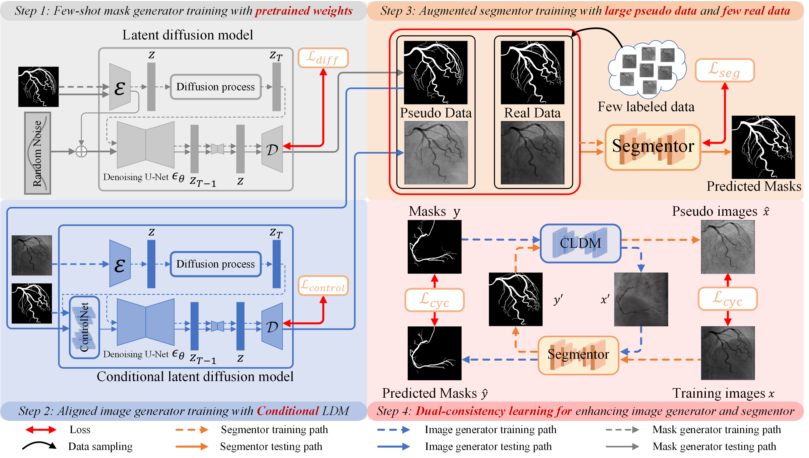

# CVI: Conditional Virtual Imaging for Few-Shot Vascular Image Segmentation
Official implementation of CVI

[NOTE!!]The code will be gradually and continuously opened!

In this work we proposed a novel Conditional Virtual Imaging (CVI) framework based on pre-trained diffusion model and our dual-consistency learning strategy which can generate authentic vessel images with few training data and achieve good performance in few-shot vessel segmentation tasks. Our model is implemented on vessel segmentation tasks of different datasets including coronary artery and retinal vessel under one-shot and five-shot situations. The promising results compared with other methods show our great superiority.

